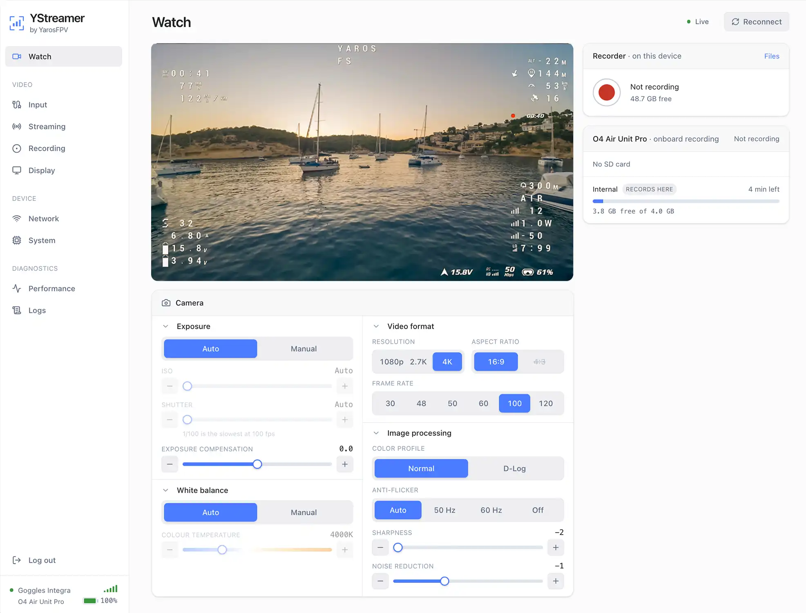
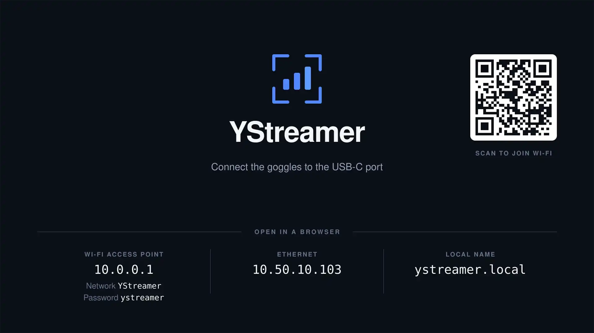
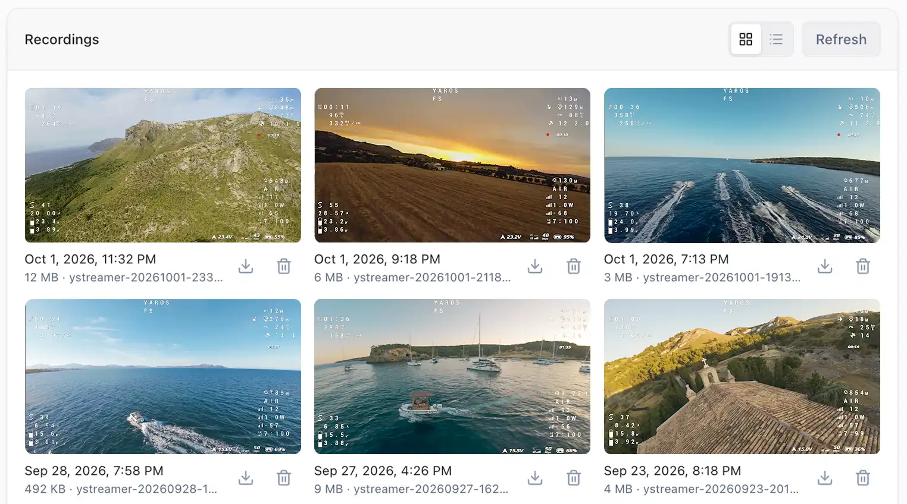
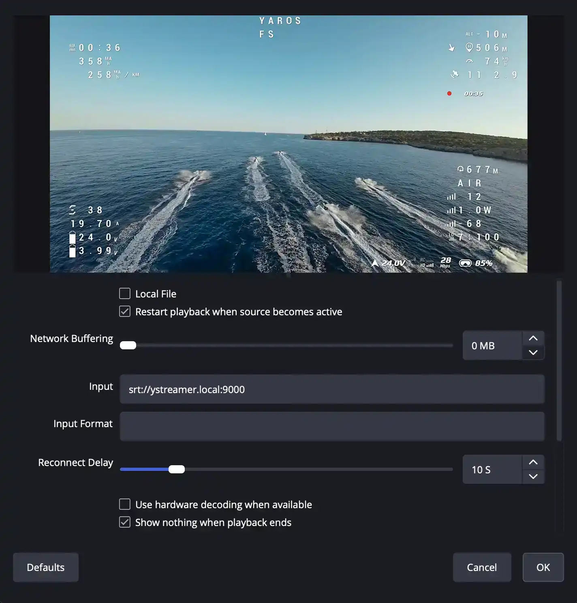

<div align="center">


# YStreamer

**Your FPV feed, on every screen.**

Raspberry Pi 4 software that takes the live video from your DJI goggles or a USB
camera and sends it to an HDMI screen, any browser, RTSP/SRT/RTMP/UDP streams
and recordings - all at once, set up from a web interface.

[](LICENSE)
[](https://www.raspberrypi.com/products/raspberry-pi-4-model-b/)
[](https://www.rust-lang.org)
[](https://gstreamer.freedesktop.org)

[**⬇️ Download**](https://ystreamer.yarosfpv.com/download) &nbsp;·&nbsp;
[**📖 Documentation**](https://ystreamer.yarosfpv.com/docs) &nbsp;·&nbsp;
[**🌐 Website**](https://ystreamer.yarosfpv.com)

</div>

---

## What it does

Plug your goggles into a Raspberry Pi 4 and everyone else gets to see what you
see. One USB-C cable in, and every output at the same time:

- **HDMI** - the feed on a TV, monitor or projector, with your logo on top.
- **Any browser** - live view on phones and laptops, over WebRTC or WebSocket.
- **Streams** - an RTSP server, plus SRT, RTMP (YouTube, Twitch, Facebook) and
  UDP for OBS, VLC, QGroundControl and Mission Planner.
- **Recording** - MP4 or MPEG-TS to the SD card or a USB drive, started by hand,
  automatically when video arrives, or with a physical button.

It also changes the **air unit's camera settings** from the browser, shows the
**goggles' battery and link quality**, offers **remote access** through
Tailscale or WireGuard, and **updates itself** with signed releases that roll
back if a new version doesn't start.

Everything is set up from the web interface at `http://ystreamer.local`. No
terminal needed.

## See it in action

<table>
  <tr>
    <td align="center" width="50%">
      <picture>
        <source media="(prefers-color-scheme: dark)" srcset="site/public/images/docs/ystreamer-ui/dark/watch-page.webp" />
        
      </picture>
      <br /><sub><b>Live view and camera settings</b></sub>
    </td>
    <td align="center" width="50%">
      
      <br /><sub><b>On HDMI, before the goggles connect</b></sub>
    </td>
  </tr>
  <tr>
    <td align="center" width="50%">
      <picture>
        <source media="(prefers-color-scheme: dark)" srcset="site/public/images/docs/ystreamer-ui/dark/recordings-card.webp" />
        
      </picture>
      <br /><sub><b>Recordings</b></sub>
    </td>
    <td align="center" width="50%">
      
      <br /><sub><b>Into OBS over SRT</b></sub>
    </td>
  </tr>
</table>

## Supported inputs

| Source                                        | Port  | Video | Camera settings | Battery & link |
| --------------------------------------------- | :---: | :---: | :-------------: | :------------: |
| DJI Goggles 2, Integra, Goggles 3, Goggles N3 | USB-C |  ✅   |       ✅        |       ✅       |
| DJI FPV Goggles V1 / V2 _(experimental)_      | USB-A |  ✅   |       ❌        |       ❌       |
| USB cameras, capture sticks, analog receivers | USB-A |  ✅   |        -        |       -        |

_Which camera settings can be changed depends on the air unit (O3, O4, O4 Pro)._

> [!NOTE]
> YStreamer is an independent project. It is not affiliated with, endorsed by
> or sponsored by DJI.

## What you need

- **Raspberry Pi 4 Model B** - the only board YStreamer is tested on.
- **A microSD card**, 16 GB or more.
- **Power through the GPIO header or a PoE HAT** - the USB-C port is reserved
  for the goggles while YStreamer is installed.
- **A USB-C to USB-C data cable** for the goggles, or a USB camera.

Wi-Fi runs on 2.4 GHz only, on purpose: 5 GHz is where the goggles' video link
lives. See [What you need](https://ystreamer.yarosfpv.com/docs/getting-started/requirements)
for the details.

## Getting started

**On a blank SD card (recommended):**

1. [Download the image](https://ystreamer.yarosfpv.com/download/ystreamer.img.xz)
   from the latest release.
2. Flash it with Raspberry Pi Imager ("Use custom") or balenaEtcher.
3. Boot the Pi, join the `YStreamer` Wi-Fi network (password `ystreamer`) and
   open `http://10.0.0.1`. An HDMI screen shows the details and a QR code too.

**On Raspberry Pi OS Lite (64-bit, Trixie)** that's already set up:

```sh
curl -fsSL https://ystreamer.yarosfpv.com/install.sh | sudo sh
```

The script checks the device, shows what it will change and asks before
installing.

See the [full documentation](https://ystreamer.yarosfpv.com/docs) for the first
boot, every output, guides for OBS, VLC and ground stations, and common issues.

## Building from source

Tasks run through [mise](https://mise.jdx.dev), which also installs the
toolchains (Rust, Node, pnpm):

```sh
# The web interface and the backend, for development
mise run frontend:dev
mise run backend:run        # as root: the hardware and port 80 need it

# Checks
mise run lint
mise run backend:test

# What ships
mise run device:package     # build and sign the .deb
mise run image:full         # .deb plus the SD card image (needs Docker)
```

On Debian or Raspberry Pi OS, `mise run backend:deps` installs the GStreamer
headers the backend builds against. `mise tasks` lists everything else.

Planning to contribute? See [CONTRIBUTING.md](CONTRIBUTING.md) for the dev setup
and how to submit changes.

## Repository layout

| Path                | What's inside                                                       |
| ------------------- | ------------------------------------------------------------------- |
| `device/backend/`   | The YStreamer service (Rust, GStreamer): video, outputs, web server |
| `device/frontend/`  | The web interface (Svelte), compiled into the backend               |
| `device/packaging/` | The Debian package, install script and update signing               |
| `image/`            | The ready-made SD card image (pi-gen)                               |
| `site/`             | The website and documentation (Astro)                               |

## Acknowledgements

**Inspiration**

- [**CosmoStreamer**](https://cosmostreamer.com): the commercial streaming box that inspired YStreamer.
- [**SquirrelCast**](https://xnuclearsquirrel.github.io/SquirrelCast-Public): a paid Android app that does something similar, and the push to start this project.

**DJI protocol documentation**

- [**samuelsadok/dji_protocol**](https://github.com/samuelsadok/dji_protocol): documentation of the DJI DUML protocol.
- [**wllm-rbnt/third-eye**](https://github.com/wllm-rbnt/third-eye): detailed documentation of the Goggles 3 USB link.

**Built with**

- [**GStreamer**](https://gstreamer.freedesktop.org) and its [Rust bindings](https://gitlab.freedesktop.org/gstreamer/gstreamer-rs): all of the video handling.
- [**webrtc-rs**](https://github.com/webrtc-rs/webrtc): the low-latency browser view.
- [**Tokio**](https://tokio.rs) and [**Axum**](https://github.com/tokio-rs/axum): the web server.
- [**Svelte**](https://svelte.dev), [**Tailwind CSS**](https://tailwindcss.com) and [**Lucide**](https://lucide.dev): the web interface.
- [**xterm.js**](https://xtermjs.org): the in-browser terminal.
- [**pi-gen**](https://github.com/RPi-Distro/pi-gen): building the SD card image on Raspberry Pi OS.

## License

YStreamer is free software, licensed under the **GNU General Public License
v3.0**. See [`LICENSE`](LICENSE) for the full text.

Copyright © 2026 YarosFPV
